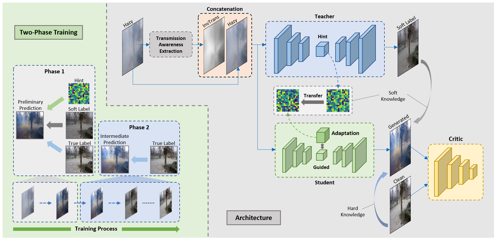

# SDDN: Soft knowledge-based Distilled Dehazing Networks

Authors: [Le-Anh Tran](https://scholar.google.com/citations?user=WzcUE5YAAAAJ&hl=en), [Dong-Chul Park](https://scholar.google.com/citations?user=VZUH4sUAAAAJ&hl=en)

## ***Updates***
- [x] Results on benchmarks
- [ ] Pre-trained weights & Inference code
- [ ] Training code

## Introduction

Diagram of the framework:

<p align="center">

</p>

(to be updated)

## Results

Quantitative results on I-HAZE, O-HAZE, Dense-HAZE, and NH-HAZE:

<p align="center">

</p>

## Citation

Please cite our works if you use the data in this repo. 

```bibtex
@misc{tran2024soft,
  author = {Tran, Le-Anh and Park, Dong-Chul},
  title = {Soft knowledge-based Distilled Dehazing Networks},
  year = {2024},
  publisher = {GitHub},
  journal = {GitHub repository}
}
```

LA Tran
