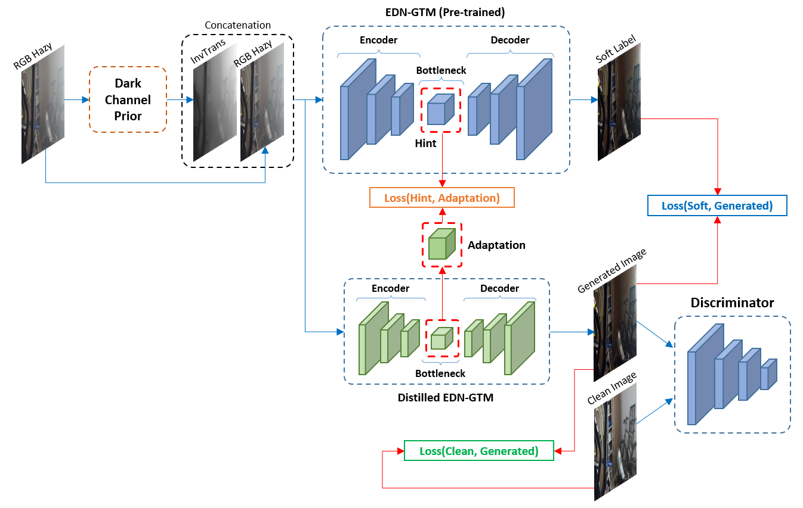
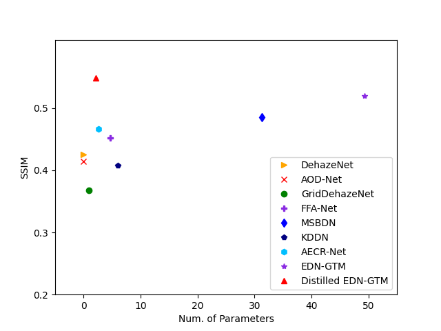

# D-EDN-GTM: Distilled Encoder-decoder Network with Guided Transmission Map for Compact Single Image Dehazing

Authors: Le-Anh Tran, Dong-Chul Park

## ***Updates***
This repo is being updated...

## I. Introduction

## II. Results

2.1 Chart

SSIM comparison on Dense-HAZE dataset

2.2 Quantitative Results
<table>
  <tr>
    <th rowspan="2">Method</th>
    <th colspan="2">Dense-HAZE</th>
    <th colspan="2">NH-HAZE</th>
    <th rowspan="2">#Parameters</th>
  </tr>
  <tr>
    <th>PSNR</th>
    <th>SSIM</th>
    <th>PSNR</th>
    <th>SSIM</th>
  </tr>
  <tr>
    <td>DCP (TPAMI’10)</td>
    <td>10.06</td>
    <td>0.3856</td>
    <td>10.57</td>
    <td>0.5196</td>
    <td>-</td>
  </tr>
  <tr>
    <td>DehazeNet (TIP’16)</td>
    <td>13.84</td>
    <td>0.4252</td>
    <td>16.62</td>
    <td>0.5238</td>
    <td>0.01M</td>
  </tr>
  <tr>
    <td>AOD-Net (ICCV’17)</td>
    <td>13.14</td>
    <td>0.4144</td>
    <td>15.40</td>
    <td>0.5693</td>
    <td>0.002M</td>
  </tr>
  <tr>
    <td>GridDehazeNet (ICCV’19)</td>
    <td>13.31</td>
    <td>0.3681</td>
    <td>13.80</td>
    <td>0.5370</td>
    <td>0.96M</td>
  </tr>
  <tr>
    <td>FFA-Net (AAAI’20)</td>
    <td>14.39</td>
    <td>0.4524</td>
    <td>19.87</td>
    <td>0.6915</td>
    <td>4.68M</td>
  </tr>
  <tr>
    <td>MSBDN (CVPR’20)</td>
    <td>15.37</td>
    <td>0.4858</td>
    <td>19.23</td>
    <td>0.7056</td>
    <td>31.35M</td>
  </tr>
  <tr>
    <td>KDDN (CVPR’20)</td>
    <td>14.28</td>
    <td>0.4074</td>
    <td>17.39</td>
    <td>0.5897</td>
    <td>5.99M</td>
  </tr>
  <tr>
    <td>AECR-Net (CVPR’21)</td>
    <td> <b>15.80</b> </td>
    <td>0.4660</td>
    <td>19.88</td>
    <td>0.7173</td>
    <td>2.61M</td>
  </tr>
  <tr>
    <td>EDN-GTM (PCS’22)</td>
    <td>15.43</td>
    <td>0.5200</td>
    <td> <b>20.24</b> </td>
    <td>0.7178</td>
    <td>49.36M</td>
  </tr>
  <tr>
    <td>*** <b>Distilled EDN-GTM (ours)</b> ***</td>
    <td>15.30</td>
    <td> <b>0.5490</b> </td>
    <td>19.64</td>
    <td> <b>0.7206</b> </td>
    <td>2.10M (&#8595;96%)</td>
  </tr>
</table>

## References
- https://github.com/tranleanh/edn-gtm

Have fun!

LA Tran
