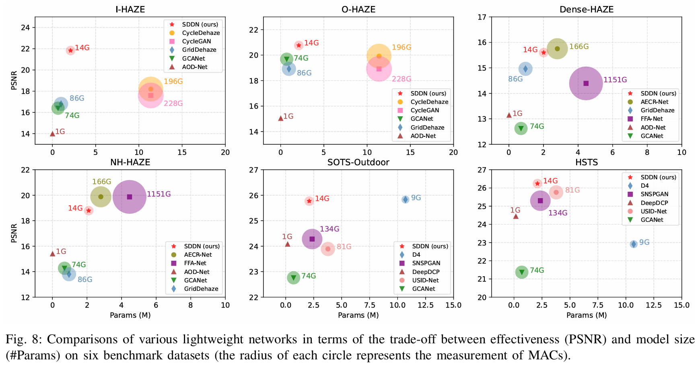

# SDDN: Soft Knowledge-based Distilled Dehazing Networks

[](https://huggingface.co/tranleanh/sddn)
[](https://www.techrxiv.org/doi/full/10.36227/techrxiv.170723333.32153858/v1)
[](https://link.springer.com/article/10.1007/s00371-024-03645-3)

The official implementation of the paper [Lightweight Image Dehazing Networks based on Soft Knowledge Distillation](https://link.springer.com/article/10.1007/s00371-024-03645-3).

Authors: [Le-Anh Tran](https://scholar.google.com/citations?user=WzcUE5YAAAAJ&hl=en), [Dong-Chul Park](https://scholar.google.com/citations?user=VZUH4sUAAAAJ&hl=en)

Journal: [The Visual Computer](https://link.springer.com/article/10.1007/s00371-024-03645-3) (Springer), 2024

<!---
## Updates

The completion of this project is currently in progress, please stay tuned for updates!

- [x] Updating results for real-world hazy scenes
- [x] Results on benchmarks (I-HAZE, O-HAZE, Dense-HAZE, NH-HAZE, SOTS-Outdoor, HSTS)
- [x] Pre-trained weights ([Hugging Face](https://huggingface.co/tranleanh/sddn))
- [x] Inference
- [x] Training
--->

## Introduction

#### Framework diagram

<p align="center">

</p>

## Test

- Create environment & install required packages
- Download pre-trained weights from [Hugging Face](https://huggingface.co/tranleanh/sddn)
- Prepare a folder containing test images

#### Command
```
python test_dehaze.py --model_path {weight_path} \
                      --image_path {input_folder_path} \
                      --output_path {output_folder_path} \
                      --ch_mul {channel_multiplier} \
                      --image_size {input_size}
```

#### Example
```
python test_dehaze.py --model_path weights/sddn_ihaze_180_11.h5 \
                      --image_path ihaze \
                      --output_path ihaze_dehazed \
                      --ch_mul 0.25 \
                      --image_size 512
```

#### Quick test with default configurations (input size: 512x512, channel multiplier: 0.25)
```
python test_dehaze.py --model_path weights/sddn_ihaze_180_11.h5 --image_path ihaze --output_path ihaze_dehazed
```

## Train

- Create environment & install required packages
- Prepare dataset folder (a parent directory containing two sub-folders 'A' and 'B' like below):

```bashrc
.../path/to/data
            | A (containing hazy images)
            | B (containing clean images)
*** Note: a pair of hazy-clean images must have the same name
```

- Configure training parameters in [train.py](https://github.com/tranleanh/sddn/blob/main/train.py#L154), the default settings are as below:

```
    # Train Parameters:
    n_images = 4
    batch_size = 1
    epoch_num = 200
    critic_updates = 5
    learning_rate = 1E-4
    loss_balance_weights = [10, 5, 5, 1]
    teacher_weight_path = 'path_to_pretrained_teacher_model'
    dataset_path = 'path_to_dataset'
```  

#### Command
```
python train.py
```

## Results

#### Quantitative results

<p align="center">

</p>

#### PSNR-Param charts

<p align="center">

</p>

#### Visual results

<p align="center">

</p>

<p align="center">

</p>

<p align="center">

</p>

<p align="center">

</p>


## Citation

Please cite our work if you use the data in this repo. 

```bibtex
@article{tran2024lightweight,
  title={Lightweight image dehazing networks based on soft knowledge distillation},
  author={Tran, Le-Anh and Park, Dong-Chul},
  journal={The Visual Computer},
  year={2024},
  publisher={Springer}
}

@article{tran2024soft,
  title={Soft Knowledge-based Distilled Dehazing Networks},
  author={Tran, Le-Anh and Park, Dong-Chul},
  journal={Authorea Preprints},
  year={2024},
  publisher={Authorea}
}
```

LA Tran
